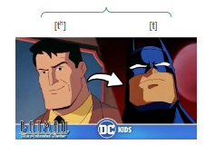
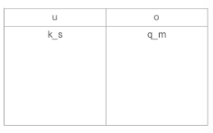

class: middle, center

# Review

---

# Review 

**Phoneme:** a set of sounds that speakers of a language treat as being the same

- written in **/slashes/**

--

**Allophone:** each individual possible sound that a phoneme could surface as

--

```{r, out.height="50%", out.width="50%", echo=FALSE}

```


---

# Review

**Contrastive distribution:** when switching out one *phoneme* for another results in a different meaning

--

- these word pairs are called *minimal pairs*

- they detect which sounds are **phonemes**

--

**Complementary distribution:** when switching a sound out for another sound *does not* change the meaning

--

- allophones of the same phoneme

- *example. [t] versus [tʰ] in English*

---

# Phonological processes

**Assimilation:** when a sound segment changes to become more similar to another nearby sound segment, which we can measure in terms of comparing their features

--

- *example: English plural /-s/ changes to [z] after a voiced stop*

--

**Dissimilation:**  when a sound changes to become less similar to another segment

--

- *example: Latin [peregrinu] → Eng. [pilgrim]*

- The first **r** dissimilates to an **l** to become less like the second **r**

---

# Phonological processes

**Insertion/Epenthesis:** when a sound segment is added to a word

--

- *example: English "stress" → Japanese [su.to.re.su]*

--

**Deletion/Elision:** when a sound is removed from a word

--

- *example: "rock and roll" → "rock n roll"*

--

**Strengthening:** processes by which sound segments get *"stronger"*

--

**Weakening:** processes by which sound segments get *"weaker"*

- ***...what do we mean by "stronger" and "weaker?"***


---

# Sonority scale

.pull-left[

***higher sonority*** (**weaker**)

  vowels
  
  glides

  liquids
  
  nasals
  
  fricatives

  affricates
  
  stops 
  
***lower sonority*** (**stronger**)
]

--

.pull-right[

- **voiced** sounds are **more sonorous** than voiceless sounds.
]

---

# Strengthening and weakening (examples)


**Strengthening**

- *th*-stopping in some American English varieties: *with* [wɪt], *them* [dɛm] (fricative → stop)

--

**Weakening**

- /t/ → [ɾ] in *butter, better, water* (/t/ becomes voiced and is no longer a stop)


---


class: center, middle

# Practice!!

---

# Practice (phonological processes)

***What phonological processes do these examples exhibit? How can you tell?***

1. English speakers often pronounce "hamster" as *"hampster"*

2. The prefix in- ‘not’, as in *indirect* and *intolerant* changes to im- in *impossible, imbalance*.

  - **Bonus:** *in-* is pronounced [ɪŋ] in *incredible, ingratitude*

3. "Tsunami" in Japanese is pronounced [tsunami], but in English it is often pronounced [sunami].

---

# Practice (phonological processes)

***What phonological processes do these examples exhibit? How can you tell?***

4. The [t] in *operate, create, mutate, vacate* becomes [ʃ] in *operation, creation, mutation, vacation*.

5. The adjectival suffix *-al*, as in *naval, vocal, animal, capital, coronal*, becomes *-ar* in words like *solar, lunar, velar, polar, angular, popular*. 

  - **Bonus:** why *floral, lateral,* not \*florar, \*laterar?

6. The [ɾ] in *atom* [æɾəm], *metal* [mɛɾəl] becomes [th] in the adjective forms *atomic* [ətʰɑmɪk], *metallic* [mətʰælik].


---

class: center, middle

# Review (phonological analysis)

---

# Review (phonological analysis)


.pull-left[
1. for each word, write the preceding and following segment **for the sound you're testing**

2. do they occur in the same or different environments?

  - *same = contrastive = seperate phonemes*
  
  - *different = complementary = allophones*

3. what do the environments of allophones have in common?

4. simplify the environments (*V_V*, *#_C*, etc.)

]


.pull-right[
```{r, out.height="100%", out.width="100%", echo=FALSE}

```

**5.** Rewrite these simplified environments as **phonological rules**

- /d/ → d / #__

- /d/ → ð / V__V


]

---

class: center, middle

# Practice (phonological analysis)

---

# Practice (phonological analysis)

**Consider this data from Italian.**

For the pair of sounds [i]-[ɛ] and [n]-[ŋ]:

--

- write the phonetic environments in which each sound occurs 

--

- are the two sounds in complementary or contrastive distribution ?

--

- are the two sounds separate phonemes or allophones of the same phoneme in Italian?

  - *if they are allophones,* what is the phonological rule for the change?

**Data on next slide...**

---

# Practice (Italian)

.pull-left[
1. [tinta] *"dye"*

2. [tɛnda] *"tent"*

3. [neɾo] *"black"*

4. [dantsa] *"dance"*

5. [dʒɛnte] *"people"*

6. [sapone] *"soap"*
]

.pull-right[

7. [tiŋgo] *"I dye"*

8. [tɛŋgo] *"I keep"*

9. [fuŋgo] *"mushroom"*

10. [bjaŋka] *"white"*

11. [aŋke] *"also"*

12. [faŋgo] *"mud"*
]


---

# Summary (last week)

**Concept groups:**

- Minimal pairs, phonemes, contrastive distribution

- complementary distribution, allophones

--

**Phonemes:** one sound in the minds of speakers

--

**Allophones:** different realizations of one sound (speakers can't always tell the difference between them)

---

# Summary (new this week)

**Assimilation:** when a segment changes to become more similar to a nearby segment (similarity is measured in features they share)

**Dissimilation:** when a segment changes to become *less* similar to a nearby segment

--

**Insertion:** when a segment/sound is *added* to a word

**Deletion:** when a sound is *removed* from a word

--

**Strengthening:** processes where a sound gets "stronger" (in terms of the sonority scale)

**Weakening:** processes where a sound gets "weaker" (sonority scale)


---

# Coming up: FINAL WEEK !

.pull-left[

- This is the last recitation :(

- HW8 due Sunday, **Dec 7**

- Last office hour on **Dec 9**

  - I will still be *available by appointment!*

- Last lecture on Wednesday, **Dec 10**

- Last day to submit late work is **Dec 10**

]

.pull-right[
```{r, out.height="100%", out.width="100%", echo=FALSE}

```

The final exam is on **Dec 19** at **12-3pm** in the lecture room *(ABE 1180)*

]

